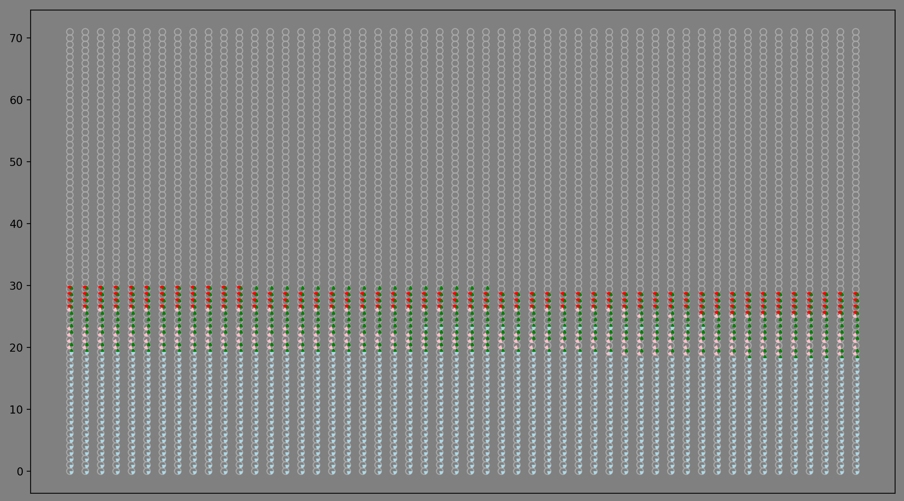

# My life in weeks

A python project to display data, from an accompanying database, as a weekly pie chart, or a page of flags showing the countries you were living in for each given week.

## Setup

Clone the repo and save the csv database in the same folder. Otherwise you can alter the path on the control.py script.

Alter the date of birth on the control.py script.

## Usage/Examples

### Wall of Flags (in development)

The output is an image, with a flag for each location you were in for a given week. The script can handle multiple flags per week, and will automatically generate partial flags when more than one country was visited per week.

The results look a bit like:

### Lie Pie Chart

Or you can choose to see your life as an array of pie charts.

Colours on the resulting piecharts are user defined and set in the database.

## Requirements

- python 3+
- numpy
- matplotlib
- Pillow

## Todos

- [x] Rename window

- [ ] Do a better job resizing circles  - Bodgy fix with landscape view.

- [x] Make colour options from database work

- [ ] Finish writing README

- [x] Make option for transposing graph (landscape/portrait)

- [x] Addition of life events (custom circle colour instead of grey)

- [ ] Wall of flags merge with main
